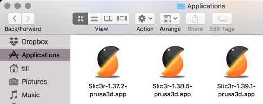
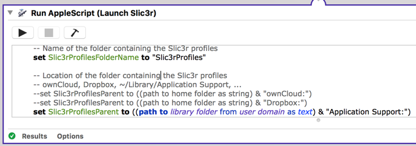
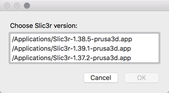
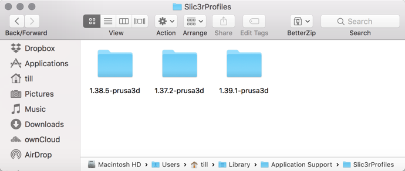

# LaunchSlic3r
Enables Mac users to choose installed Slic3r versions from a list and relocate the profiles directories.

## What is this all about?

With LaunchSlic3r you're able to:

* Keep multiple versions of Slic3r on your Mac

* Move your profile directories to your Dropbox/ownCloud/etc. folder

* Evaluate a new version of Slic3r without touching your current profiles

## Quick start

* Put multiple versions of Slic3r in your Applications folder.
This will happen automatically if you update frequently.

* Apply this naming pattern: **Slic3r - version . app**

Anything between the first dash and the last dot will count as version.

* Open LaunchSlic3r.app with Automator.app

* Edit the location where the Slic3r profiles are stored

* When starting LaunchSlic3r, you can choose the Slic3r version from a list

* Check if the Slic3r profiles are created correctly

Default location is in ~/Library/Application Support, right next to the usual location.

## You're still reading about this stuff?
It's 100% free, so have fun with it!
If you find this useful, fork it, improve it, make suggestions or send a PR.

I'm not sure if I create something similar for Windows or Linux.
I might rewrite this in a real programming language, in a portable way, but don't count on it.
